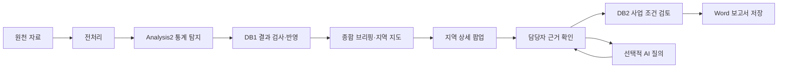

# 사회적 고립 위험신호 탐지 AI Agent

> **React 브랜치 실행:** 이 브랜치의 기본 화면은 React입니다. `frontend`에서 의존성 설치 및 빌드 후 `python main.py`로 실행합니다. [React 실행 안내](README_REACT.md)와 [팀원 수정·오류 확인 가이드](docs/React_팀원_수정_가이드.md)를 먼저 확인하세요. 기존 Streamlit 비교 실행은 `python main.py --streamlit`입니다.

> **2026 빅콘테스트 · AI데이터 활용 분야**
>
> 통신·소비·공공데이터를 활용하여 지역 및 인구집단 단위의 사회적 고립 위험신호를 탐지하고, AI Agent를 통해 적절한 복지자원과 지원 방안을 연결하는 시스템

---

## 1. 프로젝트 개요

본 프로젝트는 개인의 사회적 고립 여부를 직접 판단하는 것이 아니라, **지역 × 인구집단 단위에서 관찰되는 행동 및 사회적 맥락의 변화로부터 사회적 고립과 관련될 수 있는 위험신호를 탐지**하는 것을 목표로 합니다.

탐지된 위험신호에 대해 AI Agent가 지역의 상황과 지원 필요성을 분석하고, DB2에 구축된 복지자원 정보를 바탕으로 적절한 지원기관·프로그램·서비스를 연결합니다.

### 핵심 원칙

- 개인 단위의 사회적 고립 여부를 판정하지 않습니다.
- 단일 행동지표만으로 고립을 판단하지 않습니다.
- 행동 변화와 사회적 맥락을 함께 고려합니다.
- 데이터가 보여주는 사실과 AI Agent의 해석을 구분합니다.
- 위험신호와 추천 결과에 대해 데이터 기반의 근거를 제시합니다.

---

## 2. 시스템 아키텍처

```text
┌──────────────────── 데이터 수집 / 갱신 ────────────────────┐
│                                                            │
│  빅콘테스트 제공 데이터             공공데이터 / API       │
│  ├─ 통신 유동인구                  ├─ 인구·가구 데이터     │
│  └─ 카드 소비 데이터               └─ 사회·지역 맥락 데이터│
│                                                            │
└─────────────────────────┬──────────────────────────────────┘
                          │
                          ▼
                ┌───────────────────┐
                │ Data Pipeline     │
                │ 수집·정제·검증    │
                │ 기준 통합         │
                └─────────┬─────────┘
                          │
             ┌────────────┴────────────┐
             ▼                         ▼
┌────────────────────────┐  ┌────────────────────────┐
│ DB1                    │  │ DB2                    │
│ 분석 데이터            │  │ 복지 / 자원 데이터     │
│                        │  │                        │
│ • 원천/정제 데이터     │  │ • 복지시설             │
│ • 행동지표             │  │ • 복지 프로그램        │
│ • 분석 Feature         │  │ • 지원기관             │
│ • 위험신호/분석 결과   │  │ • 지원서비스           │
└───────────┬────────────┘  └───────────┬────────────┘
            │                           │
            ▼                           │
┌────────────────────────┐              │
│ ML / DL 분석           │              │
│                        │              │
│ • EDA                  │              │
│ • Feature Engineering  │              │
│ • 위험신호 탐지        │              │
│ • 예측/분류 모델       │              │
│ • 성능 및 설명         │              │
└───────────┬────────────┘              │
            │                           │
            └─────────────┬─────────────┘
                          ▼
                ┌─────────────────────┐
                │     AI Agent        │
                │                     │
                │     Supervisor      │
                │          │          │
                │  ┌───────┼────────┐ │
                │  ▼       ▼        ▼ │
                │ 위험/고립  맥락분석 │
                │ 분석      Agent     │
                │                     │
                │ 자원검색 → 개입추천 │
                └──────────┬──────────┘
                           │
                           ▼
                ┌─────────────────────┐
                │    Web Dashboard    │
                │                     │
                │ • 지역/연령별 신호  │
                │ • 분석 근거         │
                │ • 지원 필요성       │
                │ • 복지자원 추천     │
                │ • 결과 모니터링     │
                └─────────────────────┘
```

---

## 3. 데이터 구성

### DB1 · 분석 데이터

DB1은 프로젝트의 **데이터 분석 및 위험신호 탐지 영역**입니다.

#### 빅콘테스트 제공 데이터

| 데이터        | 주요 활용                                 |
|---------------|-------------------------------------------|
| 통신 유동인구 | 지역·연령·성별·시간·요일별 이동 패턴 분석 |
| 카드 소비     | 지역·연령·성별·시간·업종별 소비 패턴 분석 |

빅콘테스트 제공 데이터는 모델 개발과 위험신호 검증에 핵심적으로 활용합니다.

#### 공공데이터

공공데이터는 행동 데이터만으로 설명하기 어려운 지역 및 인구집단의 맥락을 보완하기 위해 활용합니다.

현재 우선 검토하는 데이터:

- 서울시 사회적 신뢰
- 함께 여가활동하는 사람
- 서울시 1인가구(연령별)

이 데이터들은 사회적 고립을 직접 나타내는 정답(label)이 아니라 **행동 변화의 맥락을 해석하기 위한 보조 지표**로 활용합니다.

### DB2 · 복지 / 자원 데이터

DB2는 위험신호가 탐지된 이후 AI Agent가 실제 지원자원을 탐색할 수 있도록 구성합니다.

예상 데이터:

- 복지시설
- 복지 프로그램
- 지원기관
- 상담·지원 서비스
- 지역별 이용 가능한 자원
- 기관 연락처 및 서비스 정보

DB2의 정보는 AI Agent의 **자원 검색 및 개입 추천**에 사용됩니다.

---

## 4. DB1 분석 프로세스

### ① 데이터 구조 및 컬럼 확인
시간·공간·연령·성별 단위, 결측치·이상치, 데이터 기간 등을 확인하고 공통 분석 기준을 정의합니다.

### ② 분석 단위 통합

기본 분석 단위:

```text
지역 × 연령집단 × 시간
```

필요한 경우:

```text
지역 × 연령집단 × 성별 × 시간
```

### ③ 행동 Feature 생성

통신 및 카드 데이터에서 지역·인구집단의 행동 패턴을 나타내는 Feature를 생성합니다.

- 유동인구 변화
- 시간대별 이동 패턴
- 요일별 이동 패턴
- 소비 규모 변화
- 소비 활동 패턴 변화
- 업종별 소비 변화

### ④ 변화(Change) 분석

특정 시점의 절대적인 수준뿐 아니라 과거 기준선과 비교한 변화를 분석합니다.

```text
현재 수준 → 기준 기간 비교 → 변화량 / 변화율
```

### ⑤ 지속성(Persistence) 분석

일시적인 변화와 지속적인 변화를 구분합니다.

```text
단기 변화 → 지속 여부 확인 → 반복적인 변화인지 확인
```

### ⑥ 다차원성(Multidimensionality) 분석

하나의 지표만으로 위험신호를 판단하지 않고 여러 행동 영역에서 변화가 동시에 나타나는지 확인합니다.

```text
이동 변화 + 소비 변화 + 사회적 맥락
                    ↓
             종합적인 위험신호 검토
```

---

## 5. ML / DL 분석

ML/DL은 **위험신호의 정량적 탐지와 분석**을 담당합니다.

LLM에게 수치 계산이나 위험점수 산출을 맡기지 않고, Python 기반 통계·ML/DL 분석을 통해 결과를 생성합니다.

### 분석 단계

1. EDA
2. Feature Engineering
3. 기준선(Baseline) 설정
4. 변화량 분석
5. 지속성 분석
6. 다차원 Feature 구성
7. 위험신호 탐지
8. ML/DL 모델 비교
9. 성능 평가
10. Feature 및 결과 해석

데이터 구조와 목표변수가 확정된 이후 적합한 문제 유형을 정의합니다.

- 분류
- 회귀
- 군집화
- 이상탐지
- 시계열 기반 분석

특정 알고리즘을 사전에 고정하지 않고 **EDA와 Feature 분석 결과를 바탕으로 모델을 결정**합니다.

---

## 6. AI Agent

AI Agent는 DB1의 분석 결과를 바탕으로 **상황을 해석하고 지원자원을 연결하는 역할**을 수행합니다.

### Supervisor

전체 Agent Workflow를 관리합니다.

```text
사용자 요청
    ↓
Supervisor
    ↓
위험/고립 분석
    ↓
맥락 분석
    ↓
지원 필요성 분석
    ↓
자원 검색
    ↓
개입 추천
    ↓
근거와 함께 결과 제공
```

### 주요 Agent

**Risk / Isolation Analysis Agent**
DB1의 위험신호 및 분석 결과를 조회하고 위험신호의 내용을 정리합니다.

**Context Analysis Agent**
인구·사회·지역 데이터를 함께 확인하여 위험신호가 나타난 지역과 집단의 맥락을 분석합니다.

**Resource Search Agent**
DB2에서 조건에 맞는 복지시설·프로그램·기관·서비스를 검색합니다.

**Intervention Recommendation Agent**
분석된 지원 필요성과 DB2의 자원을 연결하여 가능한 지원 방안을 제시합니다.

---

## 7. 위험신호 해석 구조

본 프로젝트는 단순히 `위험 / 비위험`을 출력하기보다 **판단 근거를 함께 제공하는 구조**를 지향합니다.

```text
Risk Signal
    │
    ├─ 지역
    ├─ 인구집단
    ├─ 관찰 기간
    ├─ 변화한 행동지표
    ├─ 변화의 크기
    ├─ 지속 여부
    └─ 함께 변화한 다른 지표
           │
           ▼
      Context Analysis
           │
           ▼
    Support Need Profile
           │
           ▼
    Resource Search
           │
           ▼
 Intervention Recommendation
```

AI Agent의 결과가 단순한 LLM 생성 문장이 아니라 **DB1의 분석 결과와 DB2의 자원정보를 근거로 생성**되도록 설계합니다.

---

## 8. 웹 대시보드

웹 대시보드는 분석 결과와 AI Agent의 결과를 확인할 수 있는 인터페이스입니다.

### 주요 기능

- 지역별 위험신호 확인
- 연령집단별 위험신호 확인
- 행동지표 변화 시각화
- 위험신호의 근거 확인
- 지역 및 인구집단별 상황 비교
- AI Agent 분석 결과 확인
- 추천 복지자원 확인
- 지원기관 및 프로그램 정보 확인
- 지속적인 모니터링

### 예방·대응 업무와 DB 설계 (2026-09-22)

대응 화면은 개인 대상자 관리 대신 **지역·인구집단별 예방·지원 과제**와 **서비스 연계 현황**을 관리합니다. Agent가 위험신호의 근거를 정리하고 복지자원 후보를 추천하면 담당자가 검토하여 기관 협의, 프로그램 추진, 후속 관찰로 연결합니다. 실제 개인 명단이나 개인별 고립 판정은 제공 집계데이터에서 생성하지 않습니다.

카드 소비의 가맹점 지역은 시군구이므로 유동인구와의 결합 분석은 우선 시군구·월·호환 인구집단 단위로 설계합니다. 카드 주제1의 시간대와 주제2의 고객 거주 시도는 서로 다른 레이아웃이며 실제 제공 파일을 확인하여 선택합니다. 원천 테이블명은 추적을 위해 보존하되 정제·분석·운영 테이블은 별도로 구성합니다.

- [대시보드 실행 및 구성 안내](legacy/streamlit_dashboard/README.md): 지역·집단별 변화 확인과 서비스 연계 흐름 시연

현재는 Streamlit Custom Component v2 화면입니다. DB1 결과 검사·반영과 DB2 사업 후보 조회, 업무 기록과 Word 보고서 저장을 지원합니다. 실제 기관 연락 및 자동 지원 승인은 구현하지 않았습니다. 시연 점수와 Analysis2 결과를 데이터 모드로 구분합니다.

---

## 9. 데이터 갱신 구조

빅콘테스트 제공 데이터와 지속적으로 수집할 수 있는 공공데이터를 구분합니다.

### Competition Dataset

```text
빅콘테스트 제공
통신 + 카드 데이터
        ↓
프로젝트 분석 / 모델 검증
```

### Public Data

```text
공공기관 API
      ↓
정기적 수집
      ↓
데이터 검증
      ↓
DB1 / DB2 업데이트
```

운영 구조에서는 실시간 개인 감시가 아니라 **지역 및 인구집단 단위의 정기적인 변화 모니터링**을 중심으로 합니다.

---

## 10. 기술 스택

### Data
- Python
- Pandas / NumPy
- SQL
- Public Data API

### ML / DL
- Scikit-learn
- PyTorch
- XGBoost 등 비교 검토

### AI Agent
- LangGraph
- LLM
- Multi-Agent Architecture
- Supervisor Pattern

### Database
- DB1: 분석 데이터
- DB2: 복지 / 자원 데이터

### Dashboard
- Web Dashboard
- 데이터 시각화

### Development
- Git / GitHub
- Python Virtual Environment

---

## 11. 프로젝트 개발 순서

```text
01. 원천 데이터 구조 확인
        ↓
02. DB1 컬럼 / 분석 단위 정의
        ↓
03. 데이터 전처리
        ↓
04. 행동 Feature 생성
        ↓
05. Baseline 설정
        ↓
06. Change / Persistence 분석
        ↓
07. Multidimensional Feature 구성
        ↓
08. EDA
        ↓
09. ML / DL 모델링
        ↓
10. 위험신호 및 분석 결과 DB 저장
        ↓
11. DB2 복지자원 구축
        ↓
12. AI Agent 구현
        ↓
13. LangGraph Workflow 구성
        ↓
14. Web Dashboard 연동
        ↓
15. 정기 데이터 갱신 / 모니터링
```

> **핵심 개발 원칙: Agent부터 만들지 않는다.**
> 먼저 데이터 → Feature → 분석 → 위험신호의 근거를 확립한 후 AI Agent를 연결합니다.

---

## 12. 프로젝트 기대효과

지역과 인구집단에서 나타나는 행동 변화와 사회적 맥락을 데이터로 파악하고, 필요한 지원으로 연결하는 데이터 기반 지원체계를 목표로 합니다.

- 지역별 위험신호의 조기 탐지
- 인구집단별 변화 패턴 파악
- 데이터 기반 상황 분석
- 복지자원 탐색 자동화
- 지원 필요성과 지역 자원의 연결
- 지속적인 지역 단위 모니터링

---

## 13. 현재 코드 구조

```text
main.py                       실행 명령 라우팅
frontend/                     현재 React 화면·Vite 개발 서버
webapp/                       React용 Python HTTP API
shared/                       공용 시연 계정·보고서·지도 데이터
legacy/streamlit_dashboard/
  main.py                     화면 데이터 조립
  common.py                   설정·자료 검사·분석 근거 선택 공통 함수
  design_ui.py                Custom Component 등록
  dialogs.py                  업로드·사업 검토·보고 대화상자
  ui/                         HTML·CSS·JS 화면과 지도
  tools/                      오프라인 검증·이전 시연 계산
  tests/                      계산·업무 흐름 검증
chatbot/                      로컬 안내와 선택적 AI 호출
agents/                       지역·위험 분석·사업 매칭
preprocessing/                지역 유형·행동자료 전처리
db/                           연결·분석 저장소·업무 기록
ci/                           브랜드 원본과 보미 이미지
docs/                         설계·운영 문서
```

React와 기존 화면의 공용 계정·보고서·지도는 `shared`에서 가져옵니다. 기존 Streamlit 전용 설정과 자료 검사는 `legacy.streamlit_dashboard.common`에 있습니다. DB 조회·저장은 `db`, AI 설명은 `chatbot.service`, 사업 매칭은 `agents.service_matching`이 담당합니다.

## 14. 구현 현황과 현재 업무 흐름

앞의 전체 아키텍처와 Agent 역할은 목표 설계이며, 모든 ML/DL 모델과 Supervisor가 구현된 상태를 뜻하지 않습니다. 현재 실행 경로는 다음과 같습니다.



지도 높이는 장식이며 위험도 수치가 아닙니다. 지역 클릭은 저장된 근거를 보여주고, 팝업의 업무 시작 버튼부터 업무 기록을 생성합니다. 과거 비교 이력이 부족하면 판단을 보류합니다. 기본 메뉴·지도·브리핑·로컬 안내는 LLM 토큰을 소비하지 않습니다. AI 호출을 켜고 질의를 전송한 경우에만 모델 호출을 시도합니다.

## 15. Team

**SeSAC 08 최종프로젝트**

사회적 고립 예방 및 대응을 위한 AI Agent 개발

---

## 현재 실행 및 운영 안내


지역·인구집단의 행동 변화 근거를 확인하고 복지사업 검토와 보고로 연결하는 Streamlit 대시보드입니다. 개인의 사회적 고립을 판정하지 않습니다.

## 실행

### 가상환경 설정 (Windows)

이 프로젝트는 **Python 3.13 환경에서 검증**했습니다. Python 3.13을 설치한 뒤, 터미널에서 `main.py`와 `requirements.txt`가 있는 프로젝트 루트로 이동합니다. 전역 Python과 프로젝트의 패키지가 섞이지 않도록 `.venv` 가상환경을 사용합니다.

**처음 한 번 — PowerShell에서 환경 생성 및 패키지 설치**

```powershell
py -3.13 -m venv .venv
.\.venv\Scripts\Activate.ps1
python --version
python -m pip install --upgrade pip
python -m pip install -r requirements.txt
```

`python --version`이 `Python 3.13.x`로 표시되는지 확인합니다. 이미 Python 3.13으로 만든 `.venv`가 있다면 생성 단계는 생략합니다. `py -3.13`을 찾지 못하면 Python 3.13 설치 여부를 먼저 확인합니다.

**이후 실행 — 새 터미널을 열 때마다 활성화**

```powershell
.\.venv\Scripts\Activate.ps1
python main.py
```

작업이 끝나면 `deactivate`로 가상환경을 종료합니다. 가상환경 활성화는 현재 터미널에만 적용됩니다. CMD를 사용하는 경우 활성화 명령은 `.venv\Scripts\activate.bat`입니다.

PowerShell에서 활성화가 차단되거나 활성화 없이 실행하려면 가상환경의 Python을 직접 지정할 수 있습니다.

```powershell
.\.venv\Scripts\python.exe -m pip install -r requirements.txt
.\.venv\Scripts\python.exe main.py
```

`.venv/` 폴더 자체는 Git에 올리지 않습니다. 각 팀원이 자신의 컴퓨터에서 생성하고, 루트 `requirements.txt`로 패키지를 설치합니다. 패키지 목록이 변경되면 같은 설치 명령을 다시 실행합니다.

### 실행 명령

아래 명령은 가상환경을 활성화한 상태에서 실행합니다.

```powershell
python main.py
python main.py --chatbot
python main.py --chatbot-cli
python main.py --analysis --no-download
python main.py --preprocess-analysis1 --raw-dir "원본폴더"
python main.py --preprocess --no-download
python main.py --risk --input "월별행동.csv"
```

대시보드는 보관된 version11 Analysis2 결과를 읽습니다. `--analysis`는 전처리와 Analysis2를 다시 실행합니다. `--risk --input`은 기존 v1 월별 입력 분석을 유지한 별도 도구입니다. DB2 사업 조회에는 루트 `.env`의 DB 연결 설정이 필요합니다. 키와 개인 업로드 자료는 커밋하지 않습니다.

## 폴더 안내

| 폴더 | 역할 |
| --- | --- |
| `frontend/` | 현재 React 화면, Vite 개발 서버 |
| `webapp/` | React용 Python HTTP API |
| `shared/` | 공용 시연 계정, 보고서 생성, 지도 데이터 |
| `legacy/streamlit_dashboard/` | 기존 Streamlit 화면, 컴포넌트, 업무 대화상자 |
| `chatbot/` | 시작 메뉴, 근거 설명, 데이터 질의, 독립 실행 화면 |
| `agents/` | Analysis2, v1 분석 도구, 복지사업 매칭 |
| `preprocessing/` | 지역 유형·월별 행동 자료 전처리 |
| `db/` | 공통 PostgreSQL 연결, 로컬 SQLite 업무 기록 |
| `ci/` | 브랜드 가이드, 투명 로고·캐릭터, 컬러 팔레트 |
| `docs/` | 사용자 안내와 변경 이력 |
| `external/` | 공모전 참고 자료 |

## 화면과 AI 동작

브랜드 기본색은 `#2563EB`, 보조색은 `#60A5FA`, 연결 강조색은 `#10B981`, 텍스트는 `#1E293B`입니다. 지도는 원래 행정 경계를 유지하며 마우스·키보드로 지역을 강조합니다. 장식 높이는 분석 수치가 아닙니다.

챗봇 메뉴 선택, 저장된 결과 확인, 기본 근거 안내는 AI를 호출하지 않습니다. ‘AI 에이전트 사용’을 켠 뒤 질문을 보낼 때만 호출을 허용합니다. 서버도 명시적인 호출 조건을 확인하며, Gemini 설정이 없으면 규칙 기반 안내를 제공합니다. `.env`의 `GEMINI_API_KEY`, `GEMINI_MODEL`로 연결합니다.

이전 `legacy/streamlit_dashboard/data/mission_records.sqlite3`가 있으면 최초 실행 시 `db/runtime/`로 복사 이관하며 원본을 보존합니다.

[화면 수정 안내](legacy/streamlit_dashboard/README.md) · [정리 및 검증 기록](docs/2026-10-06_대시보드_정리.md)
